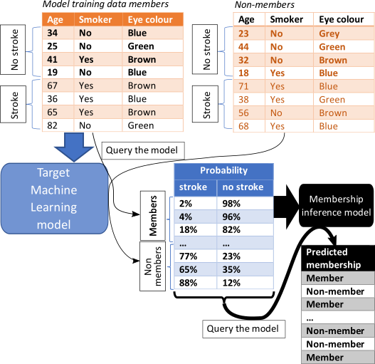

Worst Case Attack
=================

A membership inference attack (MIA) estimates the likelihood of specific data
points were included to train the ML model. If high, then the model is at risk
of data breach. If low, it is unlikely.

The Worst-Case is a black-box MIA scenario, and it does not need any shadow model. It is
described in `Rezaei`_  as the easiest possible for the attacker. To perform a MIA, a
new binary set of data (member, non-member of target train data) was created containing
the predicted probabilities of the training and test data by the target model. By default,
a Random Forest Classifier is fitted with half of this new set, though any sklearn classifier
can be configured as the attack model.

This scenario was not supposed to simulate a realistic attack (if the attacker has access
to the data, they do not need to attack) but instead to assess whether there were potential
vulnerabilities in the model that could potentially be leveraged by an attacker. This can
give a good estimation of the maximum capability of an attacker to succeed.

In some cases, the risk of data leakage could be overestimated, but it aims to ensure (as
much as possible) that any ML model allowed out of a TRE or the host environment is safe. At
the same time, it's easy to implement (see figure below).

This attack is, however, evaluated using average-case "accuracy" metrics that fail to characterize
whether the attack can confidently identify any members of the training set. For instance, imagine
the dataset includes 2 people with a rare disease, which are all the cases in a given region. In
such case these two cases could be at higher risk of being identified even if the overall estimate
risk of disclosure is low. For a more comprehensive check, the :class:`~sacroml.attacks.likelihood_attack.LIRAAttack`
is recommended. While more statistically rigorous, it comes at a much greater computational cost
than the WorstCaseAttack since it requires training multiple shadow models.

.. automodule:: sacroml.attacks.worst_case_attack
    :members:

.. _Rezaei: https://openaccess.thecvf.com/content/CVPR2021/papers/Rezaei_On_the_Difficulty_of_Membership_Inference_Attacks_CVPR_2021_paper.pdf
