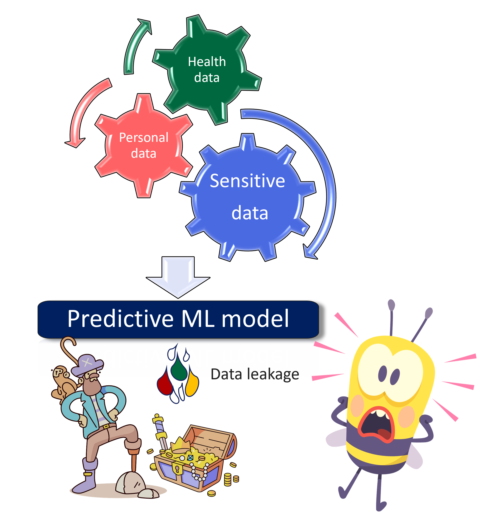

Welcome to SACRO-ML
===================

SACRO-ML is a set of tools for disclosure control of trained Machine Learning (ML) models. ML models enable the discovery of intricate relationships that a human eye and traditional statistical methods can’t. These types of powerful tools are becoming increasingly popular in many different fields. These includes medical applications and any project involving personal and sensitive data. Data breaches must be avoided. SACRO-ML helps to apply some mitigation strategies like the use of safemodels and estimate the risk of identifying any personal and sensitive data employed to build the ML model.

It is especially designed bearing in mind data privacy and mitigation strategies for disclosure control.

Typically, sensitive data is accessed via a Trusted Research Environment (TRE) or Save Heaven, which is a secure enclave. In such environments it is essential to check outputs before releasing them to guarantee there is no data breach.

 .. image:: images/TRE-project-outputcheck-overview.jpg
    :width: 400px
    :align: center
    :height: 300px
    :alt: Timeline of a life cycle of a ML model containing sensitive and personal data.

What is SafeModel?
------------------

The SafeModel package is an open source wrapper for common machine learning
models. It is designed for use by researchers in Trusted Research Environments
(TREs) where disclosure control methods must be implemented.

SafeModel aims to give researchers greater confidence that their models are
more compliant with disclosure control.

SafeModel provides feedback to the researcher through a JSON parseable
'checkfile' report:

.. code-block:: json

	{
	    "researcher": "andy",
	    "model_type": "DecisionTreeClassifier",
	    "model_save_file": "unsafe.pkl",
	    "details": "WARNING: model parameters may present a disclosure risk:\n- para
	meter min_samples_leaf = 1 identified as less than the recommended min value of
	5.",
	    "recommendation": "Do not allow release",
	    "reason": "WARNING: model parameters may present a disclosure risk:\n- param
	eter min_samples_leaf = 1 identified as less than the recommended min value of 5
	.Error: user has not called fit() method or has deleted saved values.Recommendat
	ion: Do not release."
	}

What are simulated attacks?
--------------------------
Simulated attacks are those scenarios where a ML is attacked under controlled circumstances,
and the risk of data breach is estimated. It may be used before releasing a ML model
publicly to ensure privacy.

When can SACRO-ML attack simulation be used?
~~~~~~~~~~~~~~~~~~~~~~~~~~
- When an ML model has been trained with sensitive data and want to avoid data leakage.
- The model does not contain embedded data points. Find `an example
<https://github.com/AI-SDC/SACRO-ML/blob/329-add-more-documentation/examples/risk_examples/python/instance_based_mimic.ipynb>`_
of issues with instance-based ML models.
- When the test data has not been seen by the trained model. Any data point seen by the
model during the training phase is considered part of the training data.
- The test data must have ideally 30 to 50% of the original set, and at least 20%.
- For models which predict with numerical values as opposed to binary (i.e. yes|no).

What SACRO-ML attack simulation is not intended for?
~~~~~~~~~~~~~~~~~~~~~~~~~~~~~~~~~
- For anonymous and non-sensitive datasets.
- For those ML models which contain embedded data. For example, instance-based methods
including: K-nearest neighbours (KNN), Super Vector Classifier, (SVC), Self
Organising Map (SOM), Learning Vector Quantization (LVQ), Locally Weighted Learning
(LWL), Case-Based Reasoning, Gaussian Process, Kernel-based models, etc. These models
are breaching data.
- Many of the deep learning models are at high risk of including data careful consideration should
be applied before using SACRO-ML.
- When there is no test data, or the test data has been seen by the model during the training phase.
- For any other concern that the trained model might be at risk of data breach.
- When less than 20% of the data is available (from the original dataset) for the simulated attacks.
