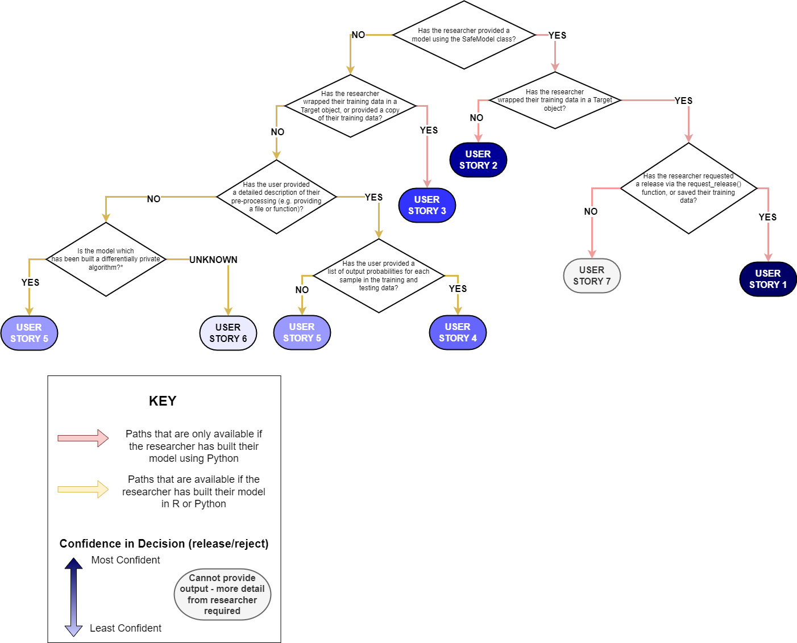

## User Stories Instructions
This folder contains example guides of how the aisdc package can be used by both a researcher and a TRE. The user guides have been split into 7 'user stories', each designed to fit a different use-case.
Which user story should be used can be found using the following flow chart and using the descriptions below.

Once the appropriate user story has been selected, the researcher should use the user_story_[x]\user_story_[x]_researcher.py as a guide to create appropriate models and metadata files for testing and release.

If using Python, researchers should follow the 'user_story_1' example to maximise the chances of their model being released.

If using R, researchers should follow the 'user_story_4' example to maximise the chances of their model being released.

If both Python and R are available, researchers should preferably use Python as more evidence against disclosivity risk can be established with this package using Python.

Once the researcher has provided all required model and data, TREs should fill out the 'default_config.yaml' file included in this repository with required experiment parameters.

The following command can then be run:

python generate_disclosure_risk_report.py

This will create a folder called 'release_files', inside which the results of the experiments can be found

Alternatively, create a new configuration file using the same format in the 'default_config.yaml' file, and pass this file to the script using the following command:

python generate_disclosure_risk_report.py --config_file [config_file_name]

## User story 1: Ideal Case
- User creates an object "target" of type aisdc.attacks.target.Target and provides a separate code file that does the translation between the data in the format provided and the data in the format to be input to the machine any model.
- User creates a model "model" from the safeXClassifier class and calls model.fit().
- User calls model.preliminary_check() to make sure their hyper-parameters are within the TRE risk appetite for algorithm X.
- User calls model.run_attack(target) for different attack types and iterates over different hyper-parameters until they have an accurate model, and they interpret attack results as safe.
- User calls model.request_release() with parameters modelsavefile.sav and  again passing the target object (without it request_release does not run attacks).
  - LIRA, worst_case, and attribute_inference attacks are run automatically,
  - results are stored ready for the TRE output checkers to look at.
  - System also saves the results of model.posthoc_check() for poor practice, model edits etc.
- TRE checker has everything they need to make a decision with no further processing.

## User story 2: Next Case
- User provides Target object and code, uses safeXClassifier() but does not pass data object to request_release() or save processed form of data.
- safeXClassifer report checks for class disclosure and TRE risk appetite for algorithm X.
- TRE output checker has to manually recreate processed data using code provided.
- TRE output checker is unable to run any attacks UNLESS they also know exactly which rows from the dataset were used for training and testing.
- So dataset object needs to store those specific details OR use fixed values for seed (e.g. to sklearn.train_test_split() ) and be extremely transparent about how stratification was done.
- If TRE has enough info to recreate train/test processed data, then they can
    - Run attacks from script.
    - Then the post-processing script
    - Then make a judgement.

## User Story 3: User provides dataset object but does not use safeXClassifier
- In this case we don’t currently have any checking for TRE-approved hyper-parameters or for class disclosure.
  - But if it is a type where we have a safemodel version, we could create functionality to load it and then check hyper-parameters using existing code
  - This raises the issue of whether safeModelClassifiers should have a load() option ?? – Is currently commented out
  - Could also provide method for checking for k-anonymity (and possible pure nodes) where appropriate by refactoring safemodels.
- TREs need to manually configure and start scripts to do LIRA, Worst_Case and Attribute_Inference attacks
   - NB this assumes their classifier outputs probabilities.

## User Story 4: User does not use safeXClassifier, or provide dataset object
### but does provide description of pre-processing, and provides output probabilities for the train and test set they have used
- We cannot assume that the TRE has the capability to get the right bits of pre-processing code from their source code.
- Do we insist on this (would be needed for ‘outside world’)? what if this is commercially sensitive?
- TRE can in theory run LIRA and worst-case but not attribute inference attacks.
  - There is a risk that they have misidentified the train/test splits to give us ones which make the classifier look less disclosive
  - But this probably falls outside our remit?
- Recommend reject???
-We could automate generalisation (as lower bound) and  worst case attacks if they give output probabilities
   – so we need to specify format
- TRE would need actual copies of processed data to run LIRA

**THIS would be the version that let people use R **

## User Story 5:  User creates differentially private algorithm (not via our code) and provides sufficient details to create data object.
#### Status: not yet implemented
- How do we know what the actual epsilon value is?
- If it is a keras model we can reload and query it if they have stored the training object as part of the model save (we need epochs, dataset size, L2 norm clip, noise values).
  -  But then their stored model probably has disclosive values in anyway …
  -   So would have to delete before release.
  - And anyway, are keras models safe against attacks that change ‘trainable’ to true for different layers and then do repeated queries viz, attacks of federated learning.
- If it is non keras then do, we take it on trust??
  - Probably yes that comes under safe researcher??

- TRE can recreate processed training and test sets and run attacks.
- Does the actual epsilon value matter if we are doing that?
   - Yes probably, because it is the sort of thing a TRE may well set as a policy.

## User Story 6: Worst Case
#### Status: not yet implemented
- User makes R model for a tree-based classifier that we have not experimented with.
- TREs get researcher to provide at minimum the processed train and test files.

- From those we can’t run LIRA (because what would shadow models be?)
-  but we can  worst-case from the command line or a script if their model outputs probabilities.
-  And we can measure generalisation error.
-  But not attribute inference.
- We have no way of checking against class disclosure e.g. all training items in a specific subgroup ending in a ‘pure’ node.

- Very hard to check and recommend release

## User Story 7: User provides safemodel with no data
- User loads in data and pre-processes out with Target object
- User uses SafeDecisionTreeClassifier
- User calls request_release() themselves, but does not pass data object to request_release() or save processed form of data.
 - SafeDecisionTreeClassifier report checks for class disclosure and TRE risk appetite for algorithm X.
- User may send the dataset to TRE, but does not provide details of pre-processing, nor gives details about which samples were used for training/testing
- TRE has to rely on their own judgement and what the researcher has told them - AISDC in this case cannot provide any additional assistance
